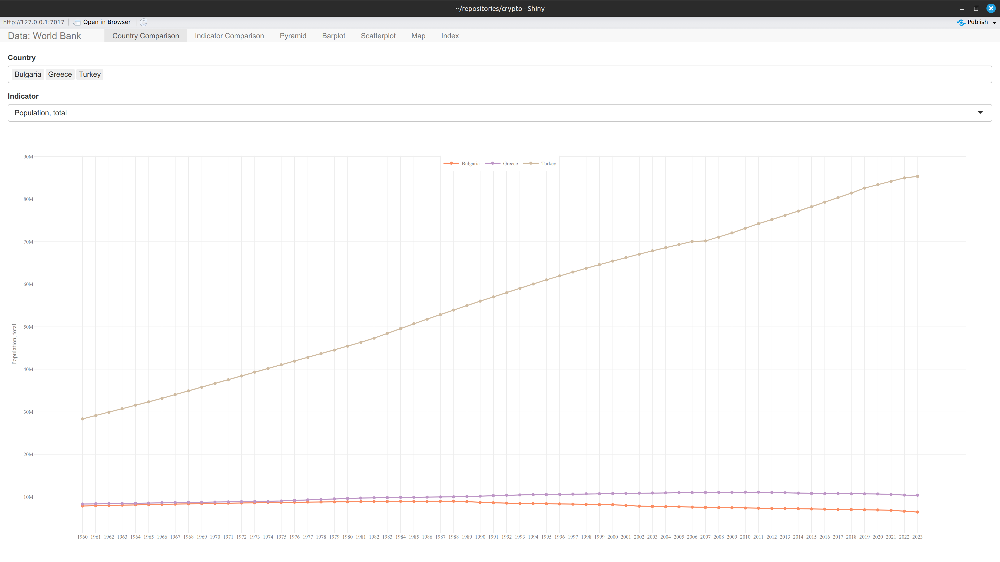
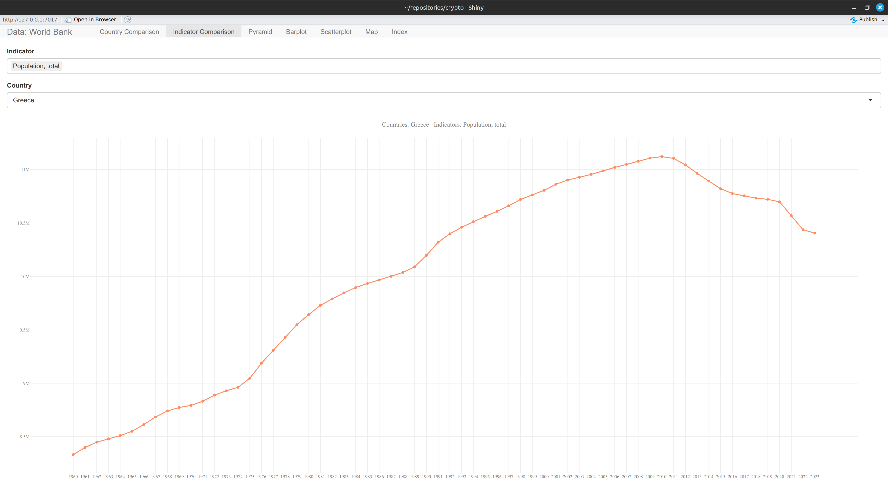
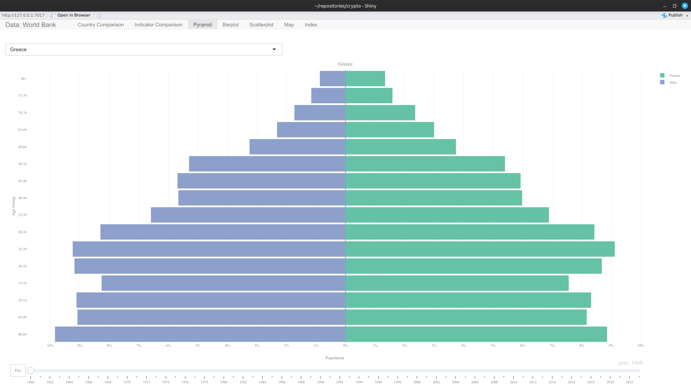
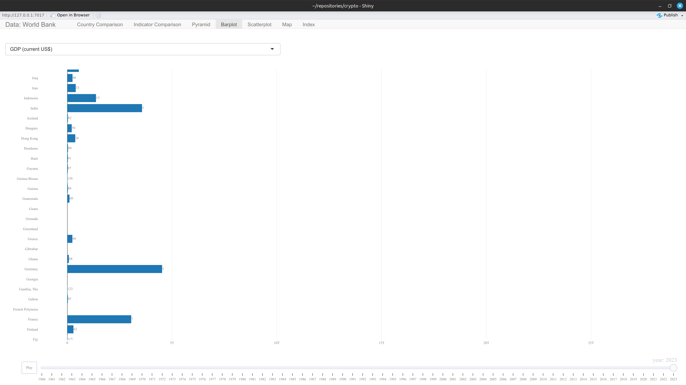
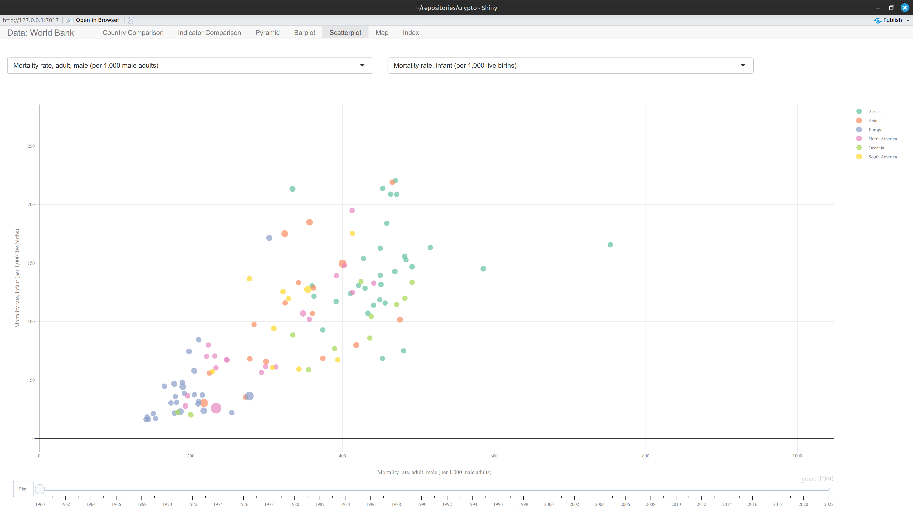
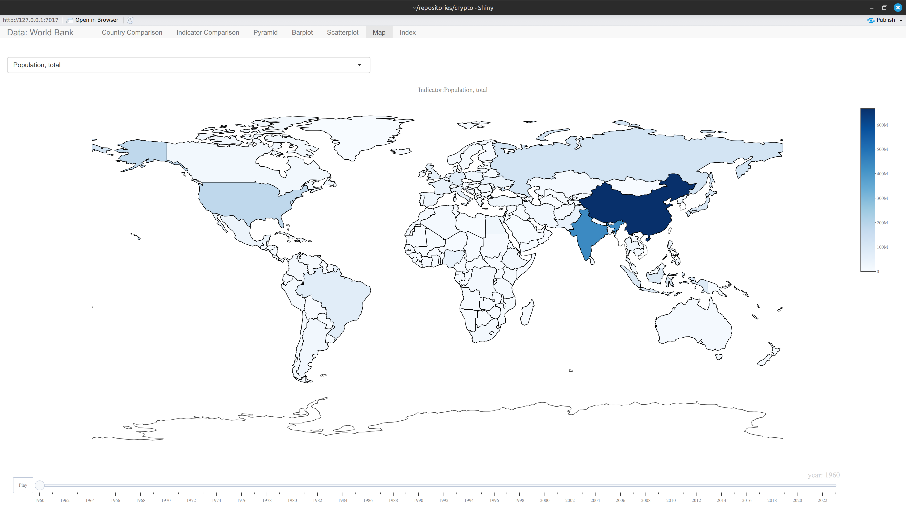
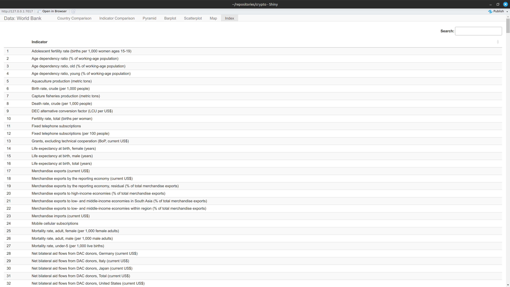

# worldbankmodular

A Shiny application, built as a [golem](https://thinkr-open.github.io/golem/) package, for exploring World Bank development indicators through interactive country comparison, indicator comparison, population pyramid, ranked bar chart, correlation scatter, and choropleth map views.

# Installation Instructions
## install R
installation instructions can be found here: https://cran.r-project.org/  
## install RStudio IDE (optional but a good idea)  
installation instructions can be found here: https://posit.co/downloads/  

open RStudio and type in the console:
```
install.packages("devtools")
library(devtools)
install_github("sedzinfo/worldbankmodular")
```

Note: `install_github()` may fail for this repository because package data files are tracked with Git LFS and GitHub source tarballs can contain LFS pointer files instead of binary `.rda` data.

# Alternative installation
Since the data range from 1960 onwards and there are thousands of indicators, we use git large file storage. Since the last update where the data file became larger than 100mb git will not accept directly so large files. As a result the traditional installation may not work.
Use one of the following reliable options:

1. Clone the repository with Git LFS enabled and install locally:
```
git lfs install
git clone https://github.com/sedzinfo/worldbankmodular.git
```
Then in R:
```
devtools::install_local("worldbankmodular")
```

2. Download the full repository and regenerate package data locally by running `financial_indicators.R` and then `generate_package.R`.

# Usage
```
library(worldbankmodular)
run_app()
```

# Update data

In order to update the data:
1. run the financial_indicators.R script
2. run the generate_package.R script

The data updates almost yearly so there is no need for frequent updates

## Features

Each feature below is a Shiny module rendered as its own tab in the app:

- 📊 **Country Comparison**: plot one indicator's value over time as one line per selected country
- 📈 **Indicator Comparison**: plot several indicators' values over time for a single country
- 👥 **Pyramid**: animated population pyramid by age group and sex, for a selected country, over time
- 📉 **Barplot**: animated ranked bar chart of one indicator per country, ranked by value in the most recent year
- 🔍 **Scatterplot**: animated bubble scatter correlating two indicators, bubble size by population, colored by region
- 🗺️ **Map**: animated choropleth map of one indicator by country, over time
- 📋 **Index**: searchable table listing every indicator name available in the data

## Data

The package ships three lazy-loaded datasets, sourced from [World Bank Open Data](https://data.worldbank.org):

- `mfi` — long-format indicator values, one row per country/indicator/year (`Country Code`, `Country Name`, `Indicator Name`, `Year`, `value`).
- `mfi_population` — long-format population counts by five-year age group and sex, used by the Pyramid tab.
- `country_code` — country/region reference metadata (region, income group, and other World Bank classifications), used to join region info in the Scatterplot tab.

Full column-level documentation is available via `?mfi`, `?mfi_population`, and `?country_code`.

---

## Git LFS Setup

Large files (e.g. datasets) are stored using [Git LFS](https://git-lfs.com). Follow the steps below to clone the repository and retrieve them.

### 1. Install Git LFS (one-time setup)

**Ubuntu/Debian:**
```bash
sudo apt install git-lfs
git lfs install
```

**Mac:**
```bash
brew install git-lfs
git lfs install
```

**Windows:**

Download and run the installer from https://git-lfs.com, then:
```bash
git lfs install
```

### 2. Clone the repository

```bash
git clone https://github.com/sedzinfo/worldbankmodular.git
cd worldbankmodular
```

### 3. Pull the LFS files

```bash
git lfs pull
```

> **Note:** If you cloned the repository *before* installing Git LFS and large files appear as small pointer files, run:
> ```bash
> git lfs install
> git lfs pull
> ```

To verify that LFS files downloaded correctly:
```bash
git lfs ls-files
```


# Screenshots









---


